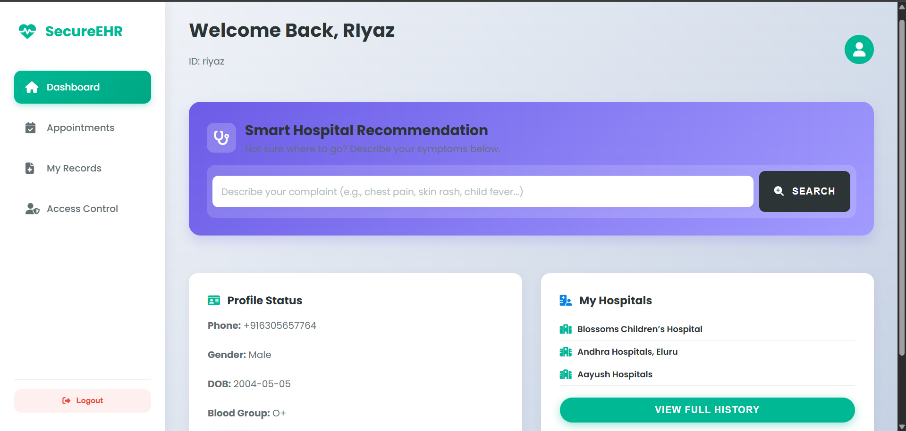
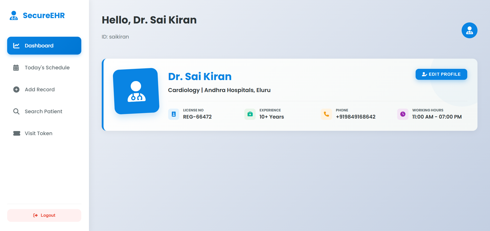
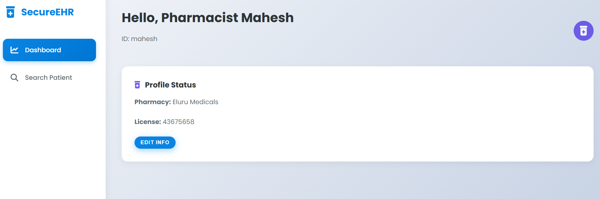
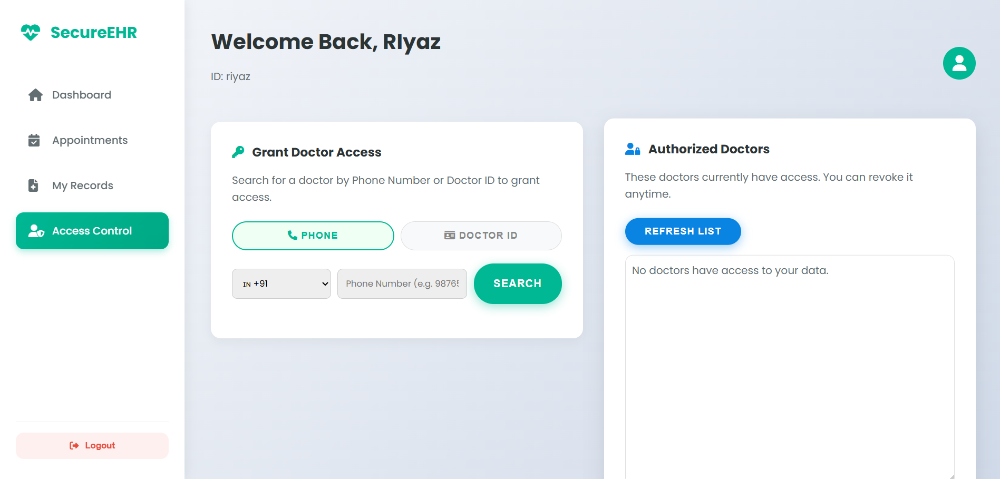
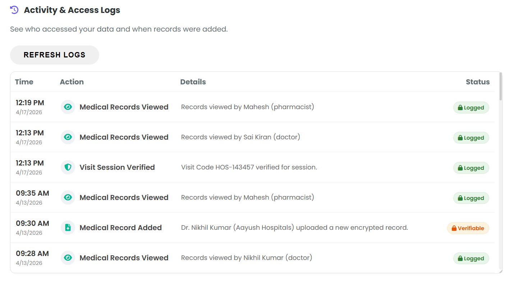
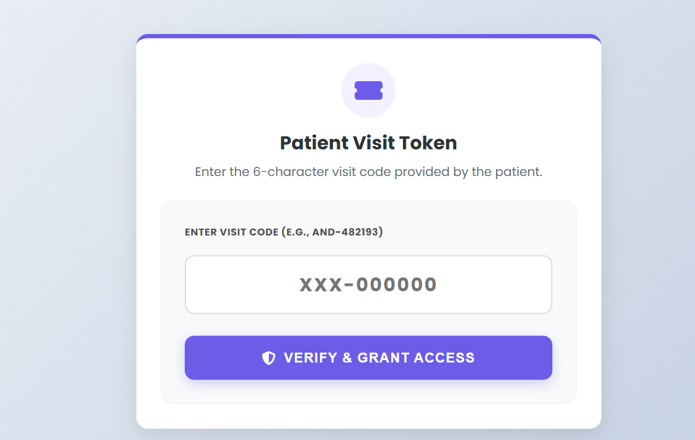

# Crypto EHR System

A secure Electronic Health Record (EHR) system designed using advanced cryptographic techniques to ensure data privacy and integrity.

## Features
- AES-256 encryption for medical data
- RSA-based key management
- JWT authentication
- Role-Based Access Control (Patient, Doctor, Admin)
- Secure file upload (PDF, Images)

## Tech Stack
- Frontend: React.js
- Backend: Node.js, Express.js
- Database: MongoDB

## Setup

### Backend
cd backend
npm install
npm start

### Frontend
cd frontend
npm install
npm start

## Screenshots

### Patient Dashboard

### Doctor Dashboard

### Pharmacist Dashboard

### Access Control

### Smart Hospital Recommendation

### Audit Log

### Visit Token

